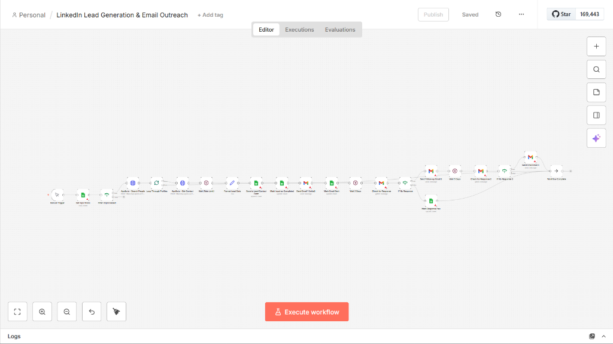
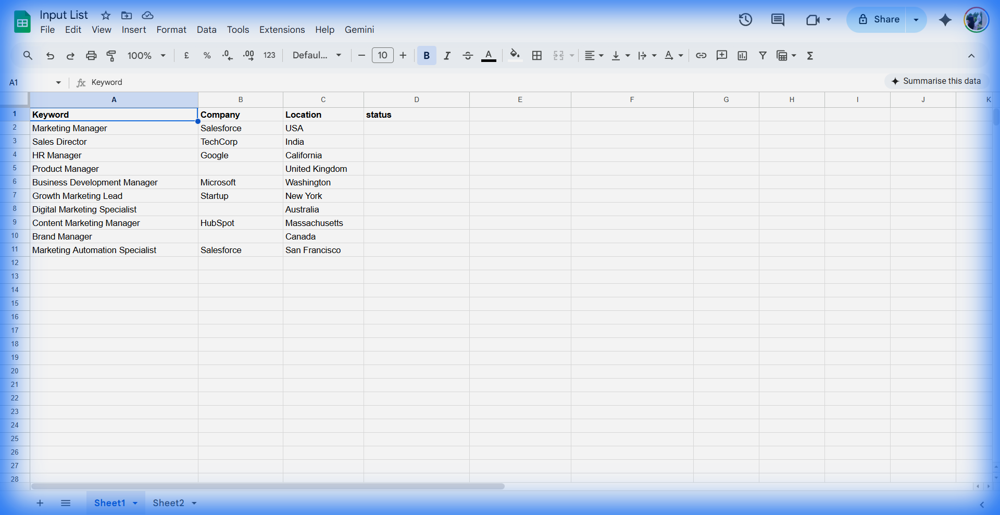
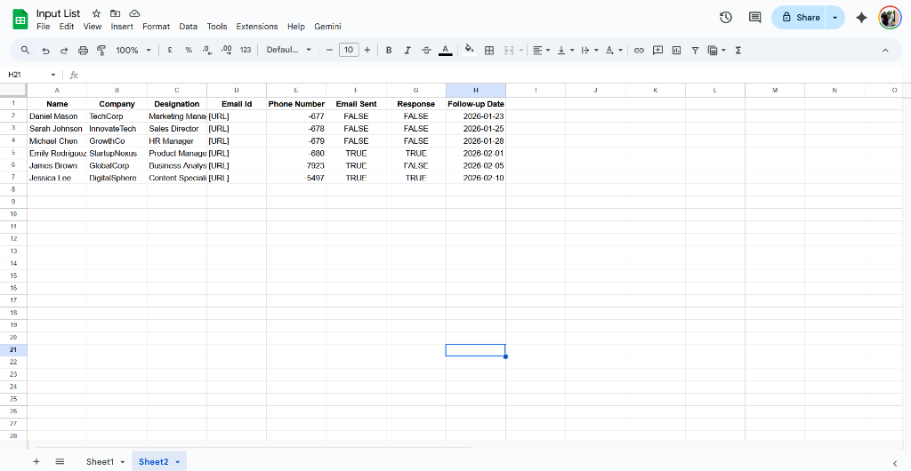

# n8n LinkedIn Lead Generation & Email Outreach Workflow

An automated workflow for LinkedIn lead generation and personalized email outreach using n8n, Google Sheets, Apollo.io, and Gmail.

---

## 📋 Task Summary

- ✅ Built an n8n workflow to fetch lead data from Google Sheets
- ✅ Generated LinkedIn search links and processed profiles sequentially
- ✅ Collected contact details using Apollo.io (hybrid approach)
- ✅ Stored lead details and tracked email status in Google Sheets
- ✅ Automated Gmail outreach with conditional follow-ups
- ✅ Updated status to prevent duplicate processing

---

## 🔄 Workflow Screenshot



---

## 📊 Google Sheets

### Input Sheet (Sheet 1)


| Column | Description | Example |
|--------|-------------|---------|
| Keyword | Job title to search | Marketing Manager |
| Company | Target company (optional) | TechCorp |
| Location | Geographic location | USA |
| status | Processing status | Completed |

### Lead Contact Form (Sheet 2)


| Column | Description |
|--------|-------------|
| Name | Full name of the lead |
| Company | Company name |
| Designation | Job title/position |
| Email Id | Contact email address |
| Phone Number | Contact phone number |
| Email Sent | TRUE/FALSE - Email status |
| Response | Response received (Yes/No) |
| Follow-up Date | Next follow-up date |

---

## 🔧 Technologies Used

| Technology | Purpose |
|------------|---------|
| **n8n Cloud** | Workflow automation platform |
| **Google Sheets** | Input data storage and lead tracking |
| **Gmail API** | Automated email sending and response checking |
| **Apollo.io** | LinkedIn profile enrichment and contact extraction |

---

## 🔄 Workflow Implementation (11 Steps)

| Step | Task | Description |
|------|------|-------------|
| 1 | Fetch Input Data | Read search keywords from Google Sheets Input List |
| 2 | Search LinkedIn | Generate LinkedIn search URLs using keyword and location |
| 3 | Loop Through Profiles | Process each profile from search results sequentially |
| 4 | Open Profile | Access individual LinkedIn profile via Apollo.io |
| 5 | Extract Contact Details | Get email and phone number using Apollo.io enrichment |
| 6 | Save to Lead Contact Form | Store extracted data in Google Sheets output sheet |
| 7 | Mark as Completed | Update status column in Input List to "Completed" |
| 8 | Repeat Process | Continue for all rows in Input List |
| 9 | Send Email 1 | Send initial outreach email via Gmail |
| 10 | Track Email Status | Update "Email Sent" column to TRUE |
| 11 | Follow-up Sequence | Send Email 2 (after 3 days) and Email 3 (after 5 more days) if no response |

---

## � Email Sequence

### Email 1 - Initial Outreach
```
Subject: Quick question about {{Company}}'s strategy

Hi {{First Name}},

I noticed your work as {{Designation}} at {{Company}} and was 
impressed by your company's achievements.

Would you be open to a brief 15-minute call next week?

Best regards,
Pavithra H N
```

### Email 2 - Follow-up (After 3 Days)
```
Subject: Re: Quick question about {{Company}}'s strategy

Hi {{First Name}},

I wanted to follow up on my previous email. Our approach has 
helped similar companies increase lead generation by 40%.

If this resonates, I'd love to schedule a quick chat.

Best,
Pavithra H N
```

### Email 3 - Final Follow-up (After 5 More Days)
```
Subject: Last attempt - {{First Name}}

Hi {{First Name}},

I don't want to clog your inbox, so this will be my last email.

Feel free to reach out whenever you're ready.

Best regards,
Pavithra H N
```

---

## �📁 Project Structure

```
n8n/
├── README.md                      # Project documentation
├── docs/
│   ├── EMAIL_TEMPLATES.md         # Email templates
│   ├── SETUP_GUIDE.md            # Setup instructions
│   └── WORKFLOW_EXPLANATION.md    # Step-by-step breakdown
├── screenshots/
│   ├── workflow_canvas.png        # Workflow screenshot
│   ├── input_sheet.png           # Input sheet screenshot
│   └── lead_sheet.png            # Lead contact form screenshot
└── workflows/
    └── linkedin_lead_gen.json     # Importable n8n workflow
```

---

## 🚀 How to Use

1. Import `workflows/linkedin_lead_gen.json` to n8n
2. Configure Google Sheets OAuth2 credential
3. Configure Gmail OAuth2 credential
4. Add Apollo.io API key to HTTP Request nodes
5. Create Google Sheets with the schema above
6. Update Sheet IDs in workflow nodes
7. Click "Execute Workflow" to run

---

## ⚠️ Important Notes

### Hybrid Approach
Due to LinkedIn platform restrictions on direct automation, this workflow uses a hybrid approach:
- LinkedIn search and data handling are automated through n8n
- Apollo.io is used for contact enrichment
- This is the **industry-standard approach** for LinkedIn-based lead generation

### Rate Limiting
- 3-second wait between Apollo.io API calls
- Gmail: ~500 emails/day for free accounts


